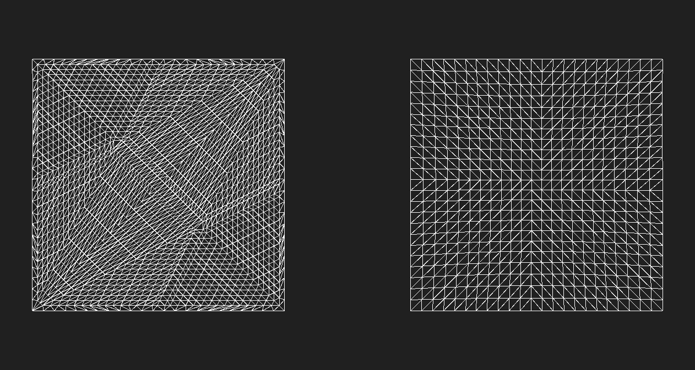

# ULTRA_primitive_quads



**Quad meshes (right) provide a more uniform distribution of vertices than triangle meshes (left) when hardware tessellation is used.**

## Contributors

- Josh Klint, Ultra Software, [@ultraengine](https://github.com/ultraengine)

## Status

Ultra Engine Vendor Extension - Currently supported in [Ultra Engine](https://www.ultraengine.com).

## Dependencies

Written against the glTF 2.0 spec.

## Overview

Although they are less common than triangle meshes, 3D models made up of quads (four-sided primtives) provide excellent iterative tessellation. Quad geometry can be evaluated in screen-space more effectively than triangles to provide a more uniform distribution of tessellated vertices, resulting in more accurate display of 3D geometry encoded in a displacement texture, as well as smoother curvature.

## Extending Primitives

Quads are requested by adding the `ULTRA_primitive_quads` extension to a primitive rendered with `"mode": 4`, `TRIANGLES`.

```json
"meshes": [
    {
        "primitives": [
            {
                "attributes": {
                    "POSITION": 0,
                    "NORMAL": 1
                },
                "indices": 3,
                "material": 0,
                "mode": 4,
                "extensions": {
                    "ULTRA_primitive_quads": {
                        "indices": 4
                    }
                }
            }
        ]
    }
]
```

## Properties

| | Type | Description | Required |
|---|---|---|---|
| indices | number | The index of the accessor to read quad indices from. | No. |

If the indices property is present, it will be used as the index of an accessor from which quad indices will be read, and the accessor count must be evenly divisible by four.

If the indices property is not present, and the primitive has an indices accessor specified, then the first four of every six indices should be used to add a quad primitive to the mesh, instead of creating triangles. In this case, the indice accessor count must be evenly divisible by six.

If the indices property is not present in the extension or in the primitive, then one quad should be created for every six vertices, and the number of vertices must be evenly divisible by six. The vertex indices to use in quad creation must match the following pattern:
```c++
for (v = 0; v < vertex_count / 6; ++v)
{
    i0 = v * 6 + 0;
    i1 = v * 6 + 1;
    i2 = v * 6 + 2;
    i3 = v * 6 + 3;
}
```

## Implementation Notes

The count property of the accessor referenced by the indices property must be evenly divisible by four.

This extension does not dictate any specific rendering technique for quad meshes. It only provides a mechanism to store meshes with quad geometry.

It is expected that in most implementations the number of quads will be half the number of triangles, and the accessor referenced in the extension will point to the same buffer as the triangle indices so that the indice array may be reused efficientaly, but these are not requirements. Implementations may reuse the triangle indice buffer or store a second buffer for quad indices.

Although this extension enhances the ability of 3D renderers to display tessellated meshes and displacement mapping, tessellation and displacement features are outside the scope of this specification.

This extension does not interfere with the loading of triangle geometry and provides backwards compatibility with all applications that support glTF 2.0.

## Justification

Although not all mesh geometry can be represented by quads, quads with tessellation produce a more even distribution of polygons than triangle tessellation. Having the ability to store quad meshes in glTF format enhances our ability to deliver greater visual acuity of tessellated meshes. This extension also allows 3D modeling programs to save and reload meshes without losing quad mesh topology.
